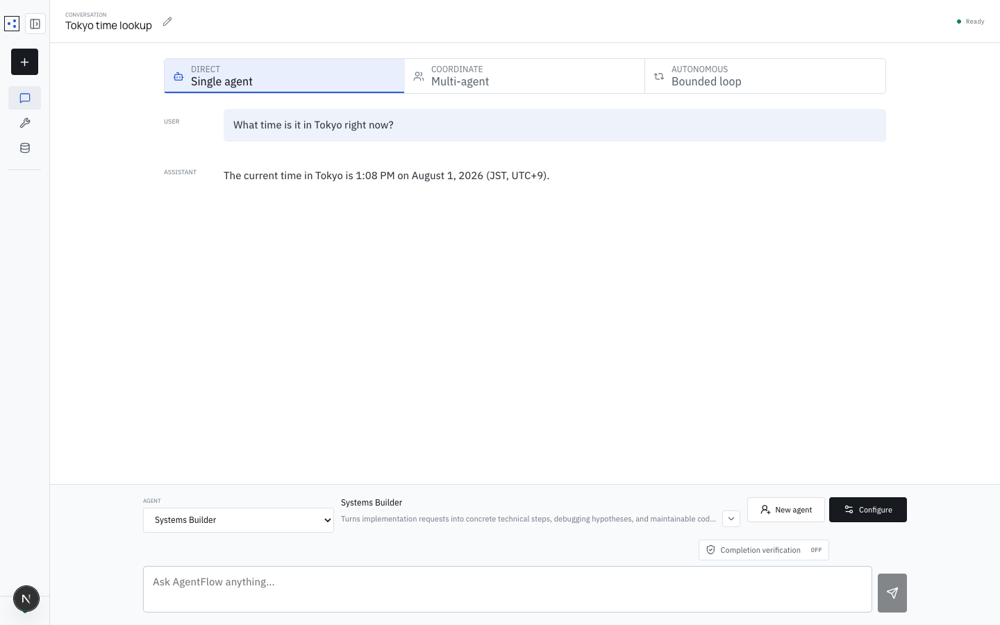
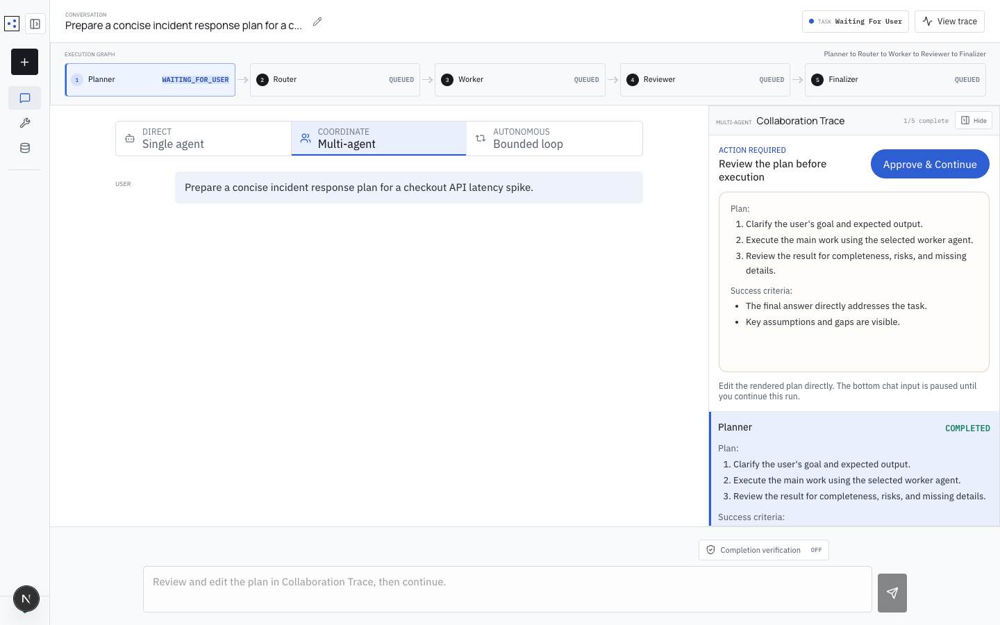
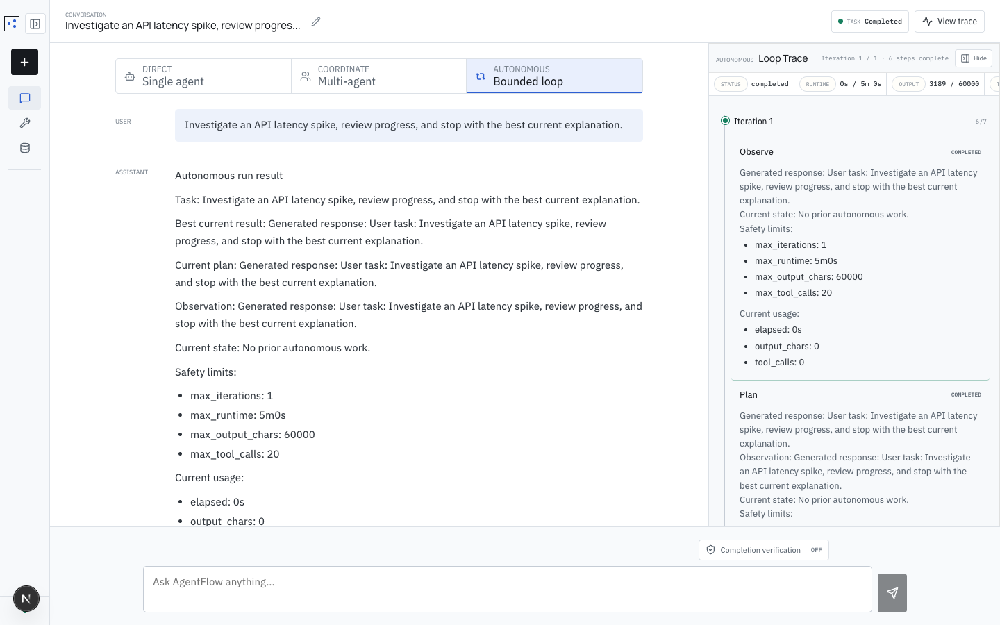
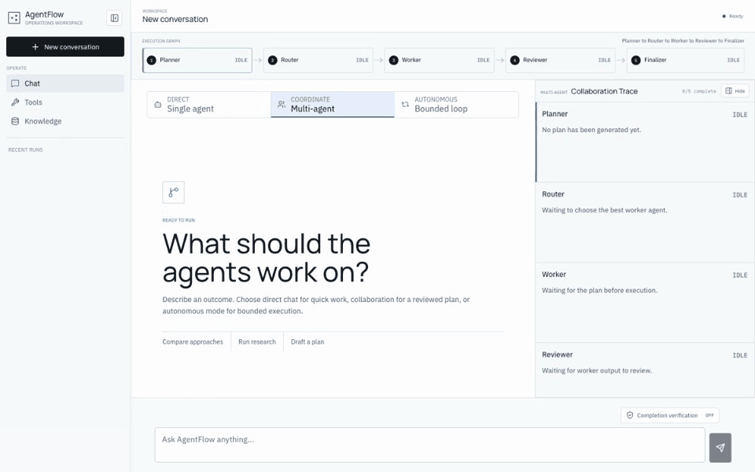
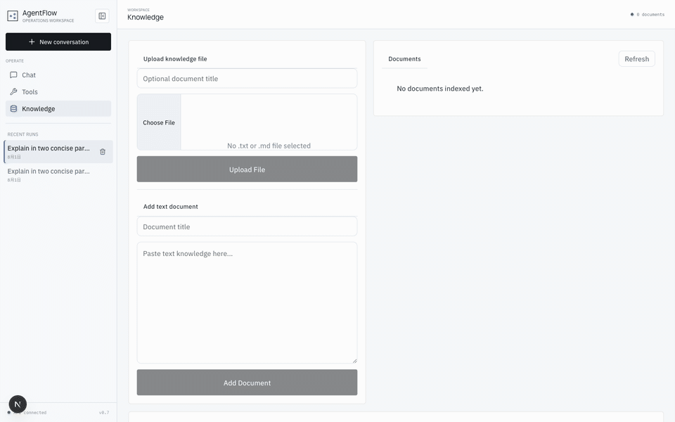
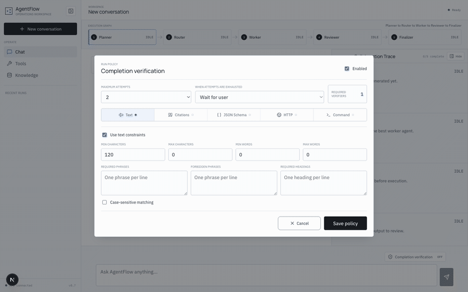

# AgentFlow Platform

[](https://github.com/hoiyd/agentflow-platform/actions/workflows/ci.yml)
[](https://app.codecov.io/gh/hoiyd/agentflow-platform)

AgentFlow is a full-stack AI agent workflow platform designed to make agent
systems reliable beyond the first demo through explicit orchestration, tool
execution, retrieval, context management, resource control, verification, and
replay.

The backend is written in Go. The frontend is a Next.js workbench for running
and inspecting Single, Multi, and bounded Loop workflows.
The project uses OpenAI-compatible model and embedding APIs, with deterministic
local fallbacks for development.

## Technical Evidence at a Glance

Reviewer shortcut: each claim below links directly to an implementation
boundary and focused regression tests.

| Boundary | Implementation evidence |
| --- | --- |
| Shared orchestration runtime | Single, Multi, and Loop converge on the same Turn Engine: [runtime](apps/api/internal/agent/runtime.go), [tests](apps/api/internal/agent/orchestrator_test.go) |
| Reproducible execution | Each Run freezes model, Agent, Tool, context, and budget policy: [snapshot](apps/api/internal/agent/runtime_snapshot.go), [tests](apps/api/internal/agent/runtime_snapshot_test.go) |
| Retrieval quality | Hybrid recall, RRF, reranking, relevance gating, and evaluation use one production pipeline: [retrieval](apps/api/internal/rag/retrieval.go), [tests](apps/api/internal/rag/retrieval_test.go) |
| Bounded concurrency | Admission control, per-Conversation serialization, queues, and model permits bound parallel work: [controller](apps/api/internal/concurrency/run_controller.go), [tests](apps/api/internal/concurrency/run_controller_test.go) |
| Verifiable outcomes | Completion Contracts gate success while typed events support Replay and Episode reports: [verification](apps/api/internal/verification/engine.go), [tests](apps/api/internal/verification/engine_test.go) |

## Three Execution Modes

AgentFlow exposes three orchestration shapes over one shared Go runtime. The
mode changes **how work is coordinated**, not which retrieval, Tool, Context,
Budget, Event, Verification, or persistence policies apply.

### Single (`single`)

For focused questions and direct tool-assisted work. One selected Agent executes
one Turn with the lowest orchestration overhead; retrieval, model/tool loops,
streaming, budgets, and optional Completion Verification still apply.

`User -> Agent Turn -> Result`



### Multi (`multi_agent`)

For work that benefits from an explicit plan, specialist routing, and
independent review. The Run pauses at `waiting_for_user` so the plan can be
edited before execution, and every handoff is persisted as an inspectable
Stage.

`User -> Planner -> Approve -> Router -> Worker -> Reviewer -> Finalizer`



### Loop (`autonomous`)

For open-ended work that needs iterative progress within hard limits. Each
Iteration observes, plans, acts, reviews, and decides whether to continue,
stop, or request human input; runtime, output, Tool, and budget limits remain
visible throughout execution.

`User -> [Observe -> Plan -> Act -> Review -> Decide] x N -> Result / Wait`



The detailed lifecycle, trade-offs, trace shape, API values, and mode-selection
guide are in [Execution modes](docs/execution-modes.md).

## Product Walkthrough

### End-to-End Multi Mode



This walkthrough follows one incident task through plan review, worker routing,
execution, review, finalization, and persisted Replay. It demonstrates **Multi**
mode; Single and Loop use the same runtime controls and evidence model with the
different orchestration shapes above. No API key is required.

### Shared RAG Pipeline



The focused RAG recording shows document indexing, independent Semantic and
Keyword ranks, RRF fusion, versioned reranking, Relevance Gate metadata, and
the merged model context. The same pipeline runs before Turns in all modes.

### Shared Verification and Trace



The focused runtime recording shows a frozen Completion Contract, a completed
Single-mode Run, Usage/Replay, `verification.*` lifecycle events, and immutable
Evidence. Verification is runtime outcome checking, not unit-test execution,
and can be enabled for Single, Multi, or Loop Runs.

## Why This Project Exists

A chat completion is easy to demonstrate. A platform must also answer harder
questions:

- What exact configuration, context, tools, and limits did this Run use?
- How do multiple agents share one execution model without duplicating logic?
- How are provider retries separated from logical model-call accounting?
- What happens when retrieval returns no confident evidence?
- Which information becomes durable memory, and why?
- Can a result be replayed, audited, resumed, canceled, or rejected by policy?

AgentFlow makes those concerns explicit in persisted domain models, typed Run
Events, frozen Runtime Snapshots, bounded execution policies, and focused
subsystems rather than hiding them inside prompts.

## Architecture at a Glance


All three execution modes share the same Turn, Retrieval, Context Assembly,
Tool, Event, Budget, and Completion paths. Mode-specific code owns only the
orchestration policy; see [Execution modes](docs/execution-modes.md) for the
exact lifecycle of each path.

## Engineering Highlights

| Concern | Implementation | Implementation evidence |
| --- | --- | --- |
| [Agent orchestration](docs/execution-modes.md) | Direct Single, plan-and-review Multi, and bounded Loop modes share one Turn Engine | [runtime](apps/api/internal/agent/runtime.go), [tests](apps/api/internal/agent/orchestrator_test.go) |
| [Configurable Agent profiles](docs/agent-profiles.md) | Persisted profiles combine a custom responsibility, system prompt, Tool allowlist, Memory/RAG switches, and Native/LangChainGo executor; Multi freezes active profiles as Router candidates | [API](apps/api/internal/httpapi/agents.go), [tests](apps/api/internal/httpapi/agents_test.go) |
| [Reproducibility](docs/terms.md#runtime-snapshot) | Each Run freezes model, agent, tool schema, context policy, and budget in a Runtime Snapshot | [snapshot](apps/api/internal/agent/runtime_snapshot.go), [tests](apps/api/internal/agent/runtime_snapshot_test.go) |
| [Hybrid RAG](docs/knowledge-rag.md) | Independent semantic and keyword recall, Reciprocal Rank Fusion, versioned pluggable reranking and relevance gating, context transformation, and native `[S1]` citations | [pipeline](apps/api/internal/rag/retrieval.go), [tests](apps/api/internal/rag/retrieval_test.go) |
| [Retrieval evaluation](docs/api-reference.md#rag-evaluation) | The workbench runs repeatable cases through the production retrieval pipeline and reports Hit@1/3/5, misses, security blocks, and component versions | [evaluation](apps/api/internal/rag/evaluation.go), [tests](apps/api/internal/knowledge/knowledge_base_test.go) |
| [Context control](docs/context-management.md) | Per-source budgets, Context Manifests, non-destructive compaction, and a protected recent message tail | [assembler](apps/api/internal/contextassembly/assembler.go), [tests](apps/api/internal/contextassembly/assembler_test.go) |
| [**Performance & resource control**](docs/execution-controls.md) | SSE streaming, bounded context/output, asynchronous Memory curation, and per-Run usage/cost budgets keep work measurable and bounded | [budget](apps/api/internal/budget/budget.go), [tests](apps/api/internal/budget/budget_test.go) |
| [**Concurrency & backpressure**](docs/execution-controls.md#1-run-admission-and-conversation-concurrency) | Global Run admission, per-Conversation single-writer execution, bounded queues, model-request permits, RPM/TPM limits, and retry-aware slot release | [controller](apps/api/internal/concurrency/run_controller.go), [tests](apps/api/internal/concurrency/run_controller_test.go) |
| [Tool governance](docs/agent-profiles.md#two-tool-control-layers) | Platform enablement and per-Agent allowlists are separate; the executor adds timeout, result limits, panic recovery, tracing, and serial/read-only/keyed concurrency | [executor](apps/api/internal/tools/executor.go), [tests](apps/api/internal/tools/executor_test.go) |
| [Durable memory](docs/memory-management.md) | Explicit rules plus optional shadow-mode model extraction propose auditable candidates before embedding | [curator](apps/api/internal/memory/curator.go), [tests](apps/api/internal/memory/curator_test.go) |
| [**Runtime outcome verification**](docs/completion-verification.md) | Frozen Completion Contracts run deterministic verifiers, persist immutable Evidence/Artifacts, and gate `run.completed` | [engine](apps/api/internal/verification/engine.go), [tests](apps/api/internal/verification/engine_test.go) |
| [**Tracing & replay**](docs/backend-architecture.md#performance-concurrency-tracing-and-verification) | Typed Run/Stage/Turn/Model/Tool/Retrieval/Verification events, usage ledgers, Replay, and Episode reports explain what happened | [episode](apps/api/internal/httpapi/episode_report.go), [tests](apps/api/internal/httpapi/episode_report_test.go) |
| [Provider and framework compatibility](docs/engineering-decisions.md#openai-compatible-does-not-mean-capability-identical) | Native orchestration keeps policy ownership; LangChainGo stays at the executor edge, while typed capability fallbacks handle provider differences in Tool Calling and stream usage metadata | [executors](apps/api/internal/agent/executor.go), [tests](apps/api/internal/openai/context_integration_test.go) |

### Performance, Concurrency, Tracing, and Verification

- **Performance-aware execution:** AgentFlow does not claim synthetic benchmark
  numbers. It exposes the mechanisms needed to tune a real deployment: streaming
  responses, bounded context and output, request/time/token/cost limits,
  asynchronous curation, and Postgres-backed atomic usage accounting.
- **Layered concurrency and backpressure:** Run admission, per-Conversation
  single-writer execution, model-request concurrency, provider RPM/TPM, Tool
  batch policy, and Run Budget intentionally control different scopes. Queue
  saturation and timeout paths produce explicit HTTP/SSE outcomes.
- **End-to-end tracing:** Typed events persist the Run, Stage, Turn, Model,
  Tool, Retrieval, Context, and Verification lifecycles. Replay and Episode
  views are projections of stored execution evidence rather than reconstructed
  frontend state.
- **Runtime Completion Verification, not test execution:** A frozen Completion
  Contract evaluates one Run's candidate output using versioned verifiers and
  immutable Evidence/Artifacts before the Completion Gate permits
  `run.completed`. Unit and integration tests validate the codebase; Completion
  Verification validates a configured outcome at runtime.

These contracts are shared by Single, Multi, and Loop modes
and by File/Postgres persistence. Model, embedding, reranking, storage, and
verifier adapters can evolve without changing the Run/Event/Budget/Verification
protocols that make execution inspectable.

## Implementation Status

| Status | Area | Current boundary |
| --- | --- | --- |
| **Implemented** | Agent runtime | Persisted custom Agent profiles; per-Agent prompt, Tool, Memory/RAG, and executor policy; Single, plan-and-review Multi, bounded Loop execution; continue/resume/cancel; and stale-run recovery |
| **Implemented** | Reliability | Runtime Snapshots, typed events, Replay, Usage Ledger, Run Budget, Context Manifests, compaction, and opt-in Completion Verification |
| **Implemented** | RAG | Markdown ingestion, source traceability, Semantic/Keyword recall, RRF, modular reranking, relevance gate, parent/adjacent context selection, deduplication, merging, and structured `[S1]` citations |
| **Implemented** | Memory | Rule-first durable-fact extraction, optional shadow/auto model extraction, candidate audit trail, policy filtering, redaction, and embedding |
| **Partial** | Workspace isolation | Scope fields and filtered expansion exist; Workspace lifecycle, mandatory production enforcement, and ACL policy are incomplete |
| **Partial** | RAG safety and evaluation | Deterministic prompt-injection filtering and evaluation API exist; semantic attack detection, versioned Golden Datasets, and calibrated thresholds remain incomplete |
| **Planned** | Grounding validation | Evidence-bound no-answer validation that requires claims to resolve to selected context sources |
| **Planned** | Runtime quality | Progress guards for repeated actions/oscillation and asynchronous human or calibrated model evidence ingestion |

## Three-to-Five-Minute Demo

1. Start the complete local stack. No API key is required for deterministic
   workflow verification:

   ```bash
   make quickstart
   ```

2. Open `http://localhost:3000`. In **Single**, create or edit an Agent and
   point out its system prompt, Tool allowlist, Memory/RAG switches, and
   executor. The same effective profile is frozen when the Run starts.
3. Open **Knowledge** and upload [`examples/example.md`](examples/example.md).
4. Search for that identifier and inspect Semantic rank, Keyword rank, RRF,
   final rerank, and the transformed model context.
5. Optionally run the sample Retrieval Evaluation cases to expose Hit@1/3/5,
   misses, security decisions, and active pipeline versions.
6. Run a Multi-Agent task against the runbook, then open **View trace** to
   connect orchestration stages, retrieval, model calls, usage, and final Run
   state. Export the Episode Report when a compact machine-readable review
   artifact is useful.

With an OpenAI-compatible key in `apps/api/.env`, the same path exercises a real
model. The key is optional so an interviewer can still inspect runtime behavior,
persistence, and Replay without provider setup or cost.

The timed walkthrough and talking points are in
[`docs/demo.md`](docs/demo.md).

## Engineering Evolution and Evidence

The repository preserves an incremental engineering path rather than presenting
the current design as a one-shot architecture:

1. Retrieval moved from runtime-specific Store calls to one shared pipeline for
   HTTP, Single, Multi, and Loop execution.
2. Semantic-only recall gained an independent keyword path, then rank-based RRF
   fusion so incomparable raw scores were never mixed directly.
3. Retrieved child chunks were separated from model context, enabling scoped
   parent/neighbor expansion, source traceability, deduplication, and merging.
4. Automatic message copying was replaced with conservative Memory Candidates,
   deterministic policy, shadow rollout, redaction, and asynchronous persistence.
5. Execution limits were separated by scope: process admission, physical model
   attempts, logical Run usage, single-call context capacity, and loop guards.
6. Final output evolved from an unqualified completion into an optional,
   evidence-gated Completion Contract with replayable artifacts.

Each step introduced a narrower contract and regression tests before the next
capability depended on it. The rationale and rejected shortcuts are recorded in
[Engineering decisions](docs/engineering-decisions.md).

## Known Boundaries

These boundaries are documented rather than hidden:

- Workspace lifecycle and mandatory production-mode tenant isolation are not
  complete. Current RAG behavior should be treated as single-workspace unless
  a caller supplies and enforces scope consistently.
- The HTTP API does not yet provide an authentication or authorization layer.
  Run it only in a trusted development environment or behind an external access
  boundary.
- Prompt-injection detection is a high-precision deterministic layer, not a
  semantic guarantee. Untrusted-context boundaries remain active even when no
  pattern is detected.
- Relevance gating is heuristic until thresholds are calibrated against a
  versioned Golden Dataset.
- RAG `no_match` prevents weak candidates from entering model context, but it
  does not yet force the model to abstain from answering from prior knowledge.
- The local hash embedding fallback is for deterministic development, not
  retrieval-quality evaluation.
- Completion Verification proves configured invariants; it does not make every
  subjective answer factually correct.

## Quick Start

### Prerequisites

- Go `1.26.5` managed through `gvm`
- Node.js `22+`
- Optional: Postgres with `pgvector`
- Optional: an OpenAI-compatible API key and Ollama embedding endpoint

### One-Command Local Start

```bash
make quickstart
```

This installs locked frontend dependencies, downloads Go modules, and starts
the API on `http://127.0.0.1:8080` plus the workbench on
`http://localhost:3000`. Press `Ctrl+C` once to stop both processes.

For subsequent runs, skip dependency installation:

```bash
make dev
```

If the default ports are occupied:

```bash
API_PORT=18080 WEB_PORT=13000 make dev
```

### Manual Start

Backend:

```bash
cd apps/api
cp .env.example .env
source ~/.gvm/scripts/gvm
gvm use go1.26.5
GOCACHE=/private/tmp/agentflow-go-build-cache go run ./cmd/server
```

The API listens on `http://127.0.0.1:8080` by default. Set `BIND_ADDRESS`
explicitly when a trusted deployment needs another interface. With no API key, the
backend uses deterministic local behavior suitable for workflow verification.

Frontend, in another terminal:

```bash
cd apps/web
npm install
npm run dev
```

Open `http://localhost:3000`. Set `NEXT_PUBLIC_API_BASE_URL` only when the API
is hosted elsewhere.

### Verification

```bash
make test
```

The command runs the complete Go package suite plus frontend lint, library
tests, and production build. Postgres integration tests remain opt-in and
require a disposable database through `TEST_DATABASE_URL`.

## Key Modules

| Module | Source |
| --- | --- |
| Application composition | [`apps/api/app/wiring.go`](apps/api/app/wiring.go) |
| Agent profiles and executor adapters | [`agents.go`](apps/api/internal/httpapi/agents.go), [`executor.go`](apps/api/internal/agent/executor.go) |
| Run lifecycle and shared runtime | [`apps/api/internal/agent/runtime.go`](apps/api/internal/agent/runtime.go) |
| Multi-Agent orchestration | [`apps/api/internal/agent/orchestrator.go`](apps/api/internal/agent/orchestrator.go) |
| Bounded Loop (`autonomous`) | [`apps/api/internal/agent/autonomous.go`](apps/api/internal/agent/autonomous.go) |
| Shared Turn Engine | [`apps/api/internal/turn/engine.go`](apps/api/internal/turn/engine.go) |
| Retrieval pipeline and RRF | [`apps/api/internal/rag/retrieval.go`](apps/api/internal/rag/retrieval.go), [`fusion.go`](apps/api/internal/rag/fusion.go) |
| Context selection and transformation | [`context_selection.go`](apps/api/internal/rag/context_selection.go), [`context_transformation.go`](apps/api/internal/rag/context_transformation.go) |
| Context Assembly | [`apps/api/internal/contextassembly/assembler.go`](apps/api/internal/contextassembly/assembler.go) |
| Memory Curation | [`apps/api/internal/memory/curator.go`](apps/api/internal/memory/curator.go) |
| Run Budget and Usage Ledger | [`apps/api/internal/budget/budget.go`](apps/api/internal/budget/budget.go), [`ledger.go`](apps/api/internal/budget/ledger.go) |
| Completion Verification | [`apps/api/internal/verification/engine.go`](apps/api/internal/verification/engine.go) |
| Persistence contracts and migrations | [`apps/api/internal/store/store.go`](apps/api/internal/store/store.go), [`postgres_migrations.go`](apps/api/internal/store/postgres_migrations.go) |
| Workbench and Replay | [`ChatShell.tsx`](apps/web/components/ChatShell.tsx), [`RunReplay.tsx`](apps/web/components/RunReplay.tsx) |

## Repository Map

```text
agentflow-platform/
  apps/
    api/
      app/                 application composition root
      cmd/server/          process entry point
      internal/            domain capabilities and adapters
    web/                   Next.js workbench
  docs/                    architecture and operational documentation
  packages/shared/         reserved shared-contract boundary
```

## Suggested Review Path

For a short technical review:

1. Compare the three [Execution modes](docs/execution-modes.md).
2. Inspect how [Agent profiles](docs/agent-profiles.md) become Single/Loop
   executors and frozen Multi Router candidates.
3. Read [Engineering decisions](docs/engineering-decisions.md).
4. Follow the [backend call paths](docs/backend-architecture.md#main-call-paths).
5. Inspect the [retrieval pipeline](docs/knowledge-rag.md#retrieval-pipeline)
   and run the [evaluation harness](docs/api-reference.md#rag-evaluation).
6. Compare [Run Budget](docs/run-budget.md) with single-call
   [Context Management](docs/context-management.md).
7. Open Replay and export its Episode Report after running a Multi or Loop task.

The complete documentation map is in [docs/README.md](docs/README.md).
