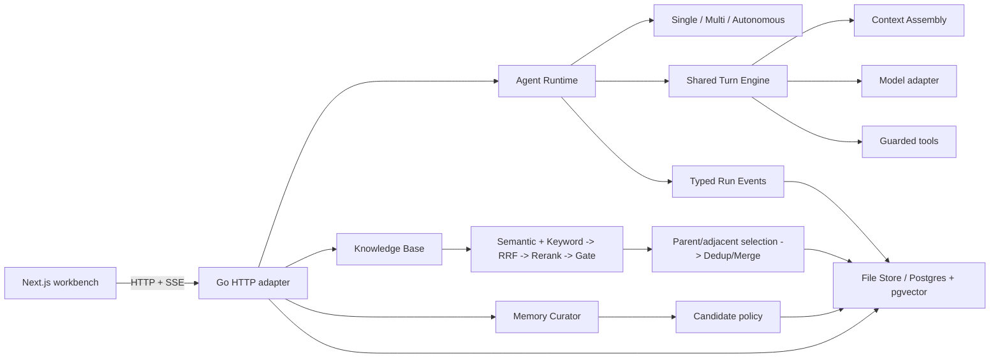

# AgentFlow Platform

[](https://github.com/hoiyd/agentflow-platform/actions/workflows/ci.yml)

AgentFlow is a full-stack AI agent workflow platform built to study the parts
that make agent systems reliable after the first demo: orchestration, tool
execution, retrieval, context management, resource control, verification, and
replay.

The backend is written in Go. The frontend is a Next.js workbench for running
and inspecting Single-Agent, Multi-Agent, and bounded Autonomous workflows.
The project uses OpenAI-compatible model and embedding APIs, with deterministic
local fallbacks for development.

## Why This Project Exists

A chat completion is easy to demonstrate. A platform must also answer harder
questions:

- What exact configuration, context, tools, and limits did this Run use?
- How do multiple agents share one execution model without duplicating logic?
- How are provider retries separated from logical model-call accounting?
- What happens when retrieval returns no confident evidence?
- Which information becomes durable memory, and why?
- Can a result be replayed, audited, resumed, canceled, or rejected by policy?

AgentFlow makes those concerns explicit in persisted domain models, typed Run
Events, frozen Runtime Snapshots, bounded execution policies, and focused
subsystems rather than hiding them inside prompts.

## Architecture at a Glance



All three execution modes share the same Turn, Retrieval, Context Assembly,
Tool, Event, Budget, and Completion paths. Mode-specific code owns only the
orchestration policy.

## Engineering Highlights

| Concern | Implementation | Evidence |
| --- | --- | --- |
| Agent orchestration | Direct, plan-and-review Multi-Agent, and bounded Autonomous modes share one Turn Engine | [Backend architecture](docs/backend-architecture.md) |
| Reproducibility | Each Run freezes model, agent, tool schema, context policy, and budget in a Runtime Snapshot | [Terms](docs/terms.md#runtime-snapshot) |
| Hybrid RAG | Independent semantic and keyword recall, Reciprocal Rank Fusion, reranking, relevance gating, context transformation, and native `[S1]` citations | [Knowledge / RAG](docs/knowledge-rag.md) |
| Context control | Per-source budgets, Context Manifests, non-destructive compaction, and a protected recent message tail | [Context management](docs/context-management.md) |
| Resource safety | Run admission, provider RPM/TPM, retry policy, per-Run budget reservations/settlements, tool limits, and autonomous guards have distinct owners | [Execution controls](docs/execution-controls.md) |
| Durable memory | Explicit rules plus optional shadow-mode model extraction propose auditable candidates before embedding | [Memory management](docs/memory-management.md) |
| Outcome verification | Frozen Completion Contracts produce immutable Evidence and gate `run.completed` | [Completion verification](docs/completion-verification.md) |
| Observability | Typed events, usage ledgers, replay, collaboration traces, and episode reports explain what happened | [Run budget](docs/run-budget.md) |
| Extensibility | Native orchestration is the default; an optional LangChainGo adapter exercises framework integration without owning platform policy | [Engineering decisions](docs/engineering-decisions.md) |

## Implementation Status

| Status | Area | Current boundary |
| --- | --- | --- |
| **Implemented** | Agent runtime | Single-Agent, plan-and-review Multi-Agent, bounded Autonomous execution, shared Turn Engine, tools, continue/resume/cancel, and stale-run recovery |
| **Implemented** | Reliability | Runtime Snapshots, typed events, Replay, Usage Ledger, Run Budget, Context Manifests, compaction, and opt-in Completion Verification |
| **Implemented** | RAG | Markdown ingestion, source traceability, independent Semantic/Keyword recall, RRF, reranking, relevance gate, parent/adjacent context selection, deduplication, merging, and structured `[S1]` citations |
| **Implemented** | Memory | Rule-first durable-fact extraction, optional shadow/auto model extraction, candidate audit trail, policy filtering, redaction, and embedding |
| **Partial** | Workspace isolation | Scope fields and filtered expansion exist; Workspace lifecycle, mandatory production enforcement, and ACL policy are incomplete |
| **Partial** | RAG safety and evaluation | Deterministic prompt-injection filtering and evaluation API exist; semantic attack detection, versioned Golden Datasets, and calibrated thresholds remain incomplete |
| **Planned** | Grounding validation | Evidence-bound no-answer validation that requires claims to resolve to selected context sources |
| **Planned** | Runtime quality | Progress guards for repeated actions/oscillation and asynchronous human or calibrated model evidence ingestion |

## Three-to-Five-Minute Demo

1. Start the complete local stack. No API key is required for deterministic
   workflow verification:

   ```bash
   make quickstart
   ```

2. Open `http://localhost:3000`, then open **Knowledge**.
3. Upload [`examples/example.md`](examples/example.md).
4. Search for that identifier and inspect Semantic rank, Keyword rank, RRF,
   final rerank, and the transformed model context.
5. Run a Multi-Agent task against the runbook, then open **View trace** to
   connect orchestration stages, retrieval, model calls, usage, and final Run
   state.

With an OpenAI-compatible key in `apps/api/.env`, the same path exercises a real
model. The key is optional so an interviewer can still inspect runtime behavior,
persistence, and Replay without provider setup or cost.

The timed walkthrough and talking points are in
[`docs/demo.md`](docs/demo.md).

## Evolution and Learning Evidence

The repository preserves an incremental engineering path rather than presenting
the current design as a one-shot architecture:

1. Retrieval moved from runtime-specific Store calls to one shared pipeline for
   HTTP, Single-Agent, Multi-Agent, and Autonomous execution.
2. Semantic-only recall gained an independent keyword path, then rank-based RRF
   fusion so incomparable raw scores were never mixed directly.
3. Retrieved child chunks were separated from model context, enabling scoped
   parent/neighbor expansion, source traceability, deduplication, and merging.
4. Automatic message copying was replaced with conservative Memory Candidates,
   deterministic policy, shadow rollout, redaction, and asynchronous persistence.
5. Execution limits were separated by scope: process admission, physical model
   attempts, logical Run usage, single-call context capacity, and loop guards.
6. Final output evolved from an unqualified completion into an optional,
   evidence-gated Completion Contract with replayable artifacts.

Each step introduced a narrower contract and regression tests before the next
capability depended on it. The rationale and rejected shortcuts are recorded in
[Engineering decisions](docs/engineering-decisions.md).

## Known Boundaries

These boundaries are documented rather than hidden:

- Workspace lifecycle and mandatory production-mode tenant isolation are not
  complete. Current RAG behavior should be treated as single-workspace unless
  a caller supplies and enforces scope consistently.
- The HTTP API does not yet provide an authentication or authorization layer.
  Run it only in a trusted development environment or behind an external access
  boundary.
- Prompt-injection detection is a high-precision deterministic layer, not a
  semantic guarantee. Untrusted-context boundaries remain active even when no
  pattern is detected.
- Relevance gating is heuristic until thresholds are calibrated against a
  versioned Golden Dataset.
- RAG `no_match` prevents weak candidates from entering model context, but it
  does not yet force the model to abstain from answering from prior knowledge.
- The local hash embedding fallback is for deterministic development, not
  retrieval-quality evaluation.
- Completion Verification proves configured invariants; it does not make every
  subjective answer factually correct.

## Quick Start

### Prerequisites

- Go `1.26.5` managed through `gvm`
- Node.js `22+`
- Optional: Postgres with `pgvector`
- Optional: an OpenAI-compatible API key and Ollama embedding endpoint

### One-Command Local Start

```bash
make quickstart
```

This installs locked frontend dependencies, downloads Go modules, and starts
the API on `http://127.0.0.1:8080` plus the workbench on
`http://localhost:3000`. Press `Ctrl+C` once to stop both processes.

For subsequent runs, skip dependency installation:

```bash
make dev
```

If the default ports are occupied:

```bash
API_PORT=18080 WEB_PORT=13000 make dev
```

### Manual Start

Backend:

```bash
cd apps/api
cp .env.example .env
source ~/.gvm/scripts/gvm
gvm use go1.26.5
GOCACHE=/private/tmp/agentflow-go-build-cache go run ./cmd/server
```

The API listens on `http://127.0.0.1:8080` by default. Set `BIND_ADDRESS`
explicitly when a trusted deployment needs another interface. With no API key, the
backend uses deterministic local behavior suitable for workflow verification.

Frontend, in another terminal:

```bash
cd apps/web
npm install
npm run dev
```

Open `http://localhost:3000`. Set `NEXT_PUBLIC_API_BASE_URL` only when the API
is hosted elsewhere.

### Verification

```bash
make test
```

The command runs the complete Go package suite plus frontend lint, library
tests, and production build. Postgres integration tests remain opt-in and
require a disposable database through `TEST_DATABASE_URL`.

## Key Modules

| Module | Source |
| --- | --- |
| Application composition | [`apps/api/app/wiring.go`](apps/api/app/wiring.go) |
| Run lifecycle and shared runtime | [`apps/api/internal/agent/runtime.go`](apps/api/internal/agent/runtime.go) |
| Multi-Agent orchestration | [`apps/api/internal/agent/orchestrator.go`](apps/api/internal/agent/orchestrator.go) |
| Bounded Autonomous loop | [`apps/api/internal/agent/autonomous.go`](apps/api/internal/agent/autonomous.go) |
| Shared Turn Engine | [`apps/api/internal/turn/engine.go`](apps/api/internal/turn/engine.go) |
| Retrieval pipeline and RRF | [`apps/api/internal/rag/retrieval.go`](apps/api/internal/rag/retrieval.go), [`fusion.go`](apps/api/internal/rag/fusion.go) |
| Context selection and transformation | [`context_selection.go`](apps/api/internal/rag/context_selection.go), [`context_transformation.go`](apps/api/internal/rag/context_transformation.go) |
| Context Assembly | [`apps/api/internal/contextassembly/assembler.go`](apps/api/internal/contextassembly/assembler.go) |
| Memory Curation | [`apps/api/internal/memory/curator.go`](apps/api/internal/memory/curator.go) |
| Run Budget and Usage Ledger | [`apps/api/internal/budget/budget.go`](apps/api/internal/budget/budget.go), [`ledger.go`](apps/api/internal/budget/ledger.go) |
| Completion Verification | [`apps/api/internal/verification/engine.go`](apps/api/internal/verification/engine.go) |
| Persistence contracts and migrations | [`apps/api/internal/store/store.go`](apps/api/internal/store/store.go), [`postgres_migrations.go`](apps/api/internal/store/postgres_migrations.go) |
| Workbench and Replay | [`ChatShell.tsx`](apps/web/components/ChatShell.tsx), [`RunReplay.tsx`](apps/web/components/RunReplay.tsx) |

## Repository Map

```text
agentflow-platform/
  apps/
    api/
      app/                 application composition root
      cmd/server/          process entry point
      internal/            domain capabilities and adapters
    web/                   Next.js workbench
  docs/                    architecture and operational documentation
  packages/shared/         reserved shared-contract boundary
```

## Suggested Review Path

For a short technical review:

1. Read [Engineering decisions](docs/engineering-decisions.md).
2. Follow the [backend call paths](docs/backend-architecture.md#main-call-paths).
3. Inspect the [retrieval pipeline](docs/knowledge-rag.md#retrieval-pipeline).
4. Compare [Run Budget](docs/run-budget.md) with single-call
   [Context Management](docs/context-management.md).
5. Open the workbench Replay view after running a Multi-Agent or Autonomous task.

The complete documentation map is in [docs/README.md](docs/README.md).
