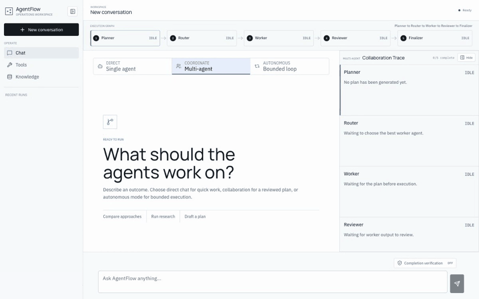
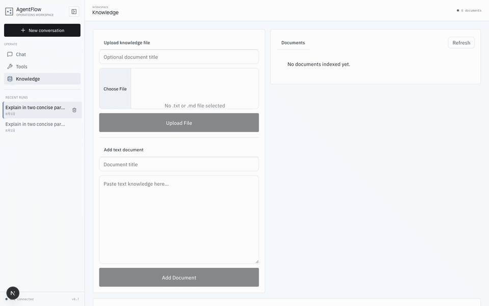
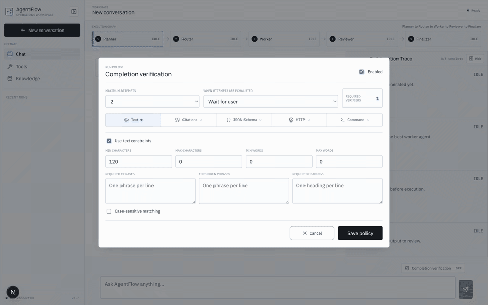
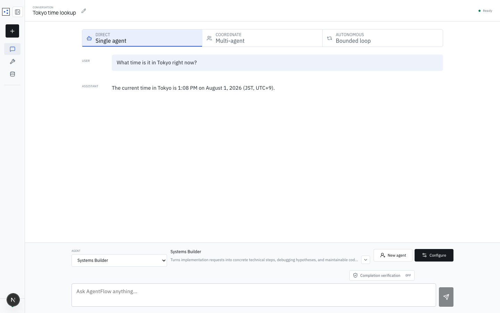
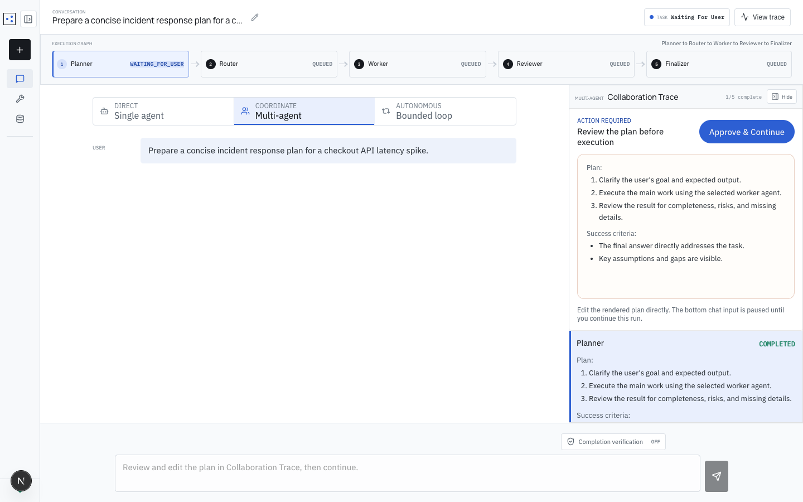
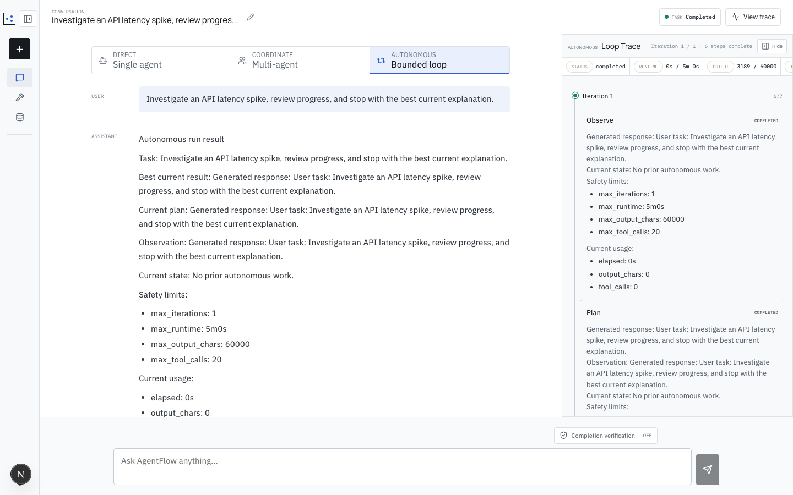
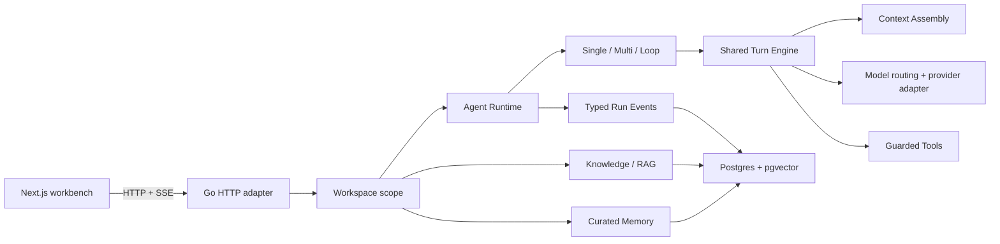

# AgentFlow Platform

[](https://github.com/hoiyd/agentflow-platform/actions/workflows/ci.yml)
[](https://app.codecov.io/gh/hoiyd/agentflow-platform)

AgentFlow is a Go AI Agent Runtime with a Next.js workbench. It makes execution
inspectable through frozen configuration, guarded Tools, bounded context and
usage, verification evidence, and durable Replay.

Chat uses credentialed OpenAI-compatible routes; embeddings can use local
Ollama. Simulation is explicit and confined to offline tests and evaluation.
PostgreSQL with pgvector is the only application persistence backend.

## Demo Gallery

### Multi-Agent Execution and Replay



An incident task progresses through plan approval, routing, execution, review,
and Replay.

### Knowledge and Retrieval



Document ingestion, hybrid recall, ranking, relevance gating, and source-backed
Context selection.

### Completion Verification



A Completion Contract connects the final output to Verification Evidence,
Usage, and Replay. Recordings show behavior, not performance or model-quality benchmarks.

### Workbench Modes

| Single | Multi | Loop |
| --- | --- | --- |
| [](docs/assets/single-mode.png) | [](docs/assets/multi-mode.png) | [](docs/assets/loop-mode.png) |

These mode screenshots are offline visual references; select an image for the
full-size view. The [five-minute demo](docs/guides/demo.md) covers setup, the
walkthrough, and a deterministic no-network evidence path.

## Execution Modes

All modes share one Turn Engine and the same policy, accounting, and event
contracts. Use the least orchestration the task needs:

| Mode | Execution shape | Use when |
| --- | --- | --- |
| Single (`single`) | One Agent Turn with native model/Tool rounds and streamed answers | One owner can handle the request |
| Multi (`multi_agent`) | Planner -> plan approval -> Router -> isolated Worker -> Reviewer -> Finalizer | An approved plan, specialist routing, or independent review matters |
| Loop (`autonomous`) | Bounded Observe -> Plan -> Act -> Review -> Decide iterations | The next action depends on previous results or human input |

Multi's Worker is an isolated Stage inside one Run, not a Child Run. Loop can
pause for input without discarding progress. See
[execution modes](docs/runtime/execution-modes.md) for topology, trade-offs,
streaming, and recovery behavior.

## Architecture


```mermaid
flowchart LR
    UI[Next.js workbench] -->|HTTP + SSE| API[Go HTTP adapter]
    API --> Scope[Workspace scope]
    Scope --> Runtime[Agent Runtime]
    Runtime --> Modes[Single / Multi / Loop]
    Modes --> Turn[Shared Turn Engine]
    Turn --> Context[Context Assembly]
    Turn --> Model[Model routing + provider adapter]
    Turn --> Tools[Guarded Tools]
    Scope --> Knowledge[Knowledge / RAG]
    Scope --> Memory[Curated Memory]
    Runtime --> Events[Typed Run Events]
    Events --> Store[Postgres + pgvector]
    Knowledge --> Store
    Memory --> Store
```

| Engineering boundary | What it provides | Details |
| --- | --- | --- |
| Agent execution | Configurable profiles, capability-aware Worker selection, one lifecycle and Stage checkpoints | [Profiles](docs/runtime/agent-profiles.md), [selection](docs/runtime/agent-selection.md), [recovery](docs/runtime/durable-recovery.md) |
| Frozen protocol | Resume reuses captured mode, routes/sampling, Agents, Skills, Tool authority, context config, and budgets | [Runtime Snapshot](docs/architecture/terms.md#runtime-snapshot), [model routing](docs/runtime/model-routing.md) |
| Context and Memory | Source budgets and Manifests, non-destructive compaction, exact-history recovery, versioned Task State and curated Memory | [Context](docs/context/context-management.md), [Task State](docs/runtime/task-state.md), [Memory](docs/context/memory-management.md) |
| Knowledge grounding | Semantic + Keyword recall, RRF, separate reranking/Gate, bounded parent/adjacent expansion, and source-backed citations | [Knowledge / RAG](docs/knowledge/knowledge-rag.md) |
| Tools and Skills | Shared schema validation, scope authorization, bounded multi-round execution, result Artifacts, progress guards, and progressively loaded trusted methods | [Tool security](docs/tools/tool-security-policy.md), [Tool loop](docs/tools/bounded-tool-loop.md), [Skills](docs/tools/trusted-skills.md) |
| Resource control | Conversation single-writer, bounded Run admission, physical-request permits/RPM/TPM, typed retry, and cumulative Run usage/cost | [Execution controls](docs/runtime/execution-controls.md), [Run Budget](docs/runtime/run-budget.md) |
| Completion and operations | Opt-in verification gate, immutable Evidence, uncertain-effect reconciliation, Replay/Episode, and Needs attention | [Verification](docs/runtime/verification.md), [reconciliation](docs/tools/tool-side-effect-reconciliation.md), [attention](docs/runtime/operator-attention.md) |
| Measurable evidence | Context/RAG/routing/Tool regression gates, live benchmark profiles, controlled Run comparison, load and recovery drills | [Evaluation guide](docs/evaluation/README.md) |

Package ownership, source entry points, and call paths are in
[backend architecture](docs/architecture/backend-architecture.md). Design
trade-offs and retired approaches are in
[engineering decisions](docs/architecture/engineering-decisions.md).

## Quick Start

Requires Go 1.26.5 through gvm, Node.js 22+, and a running PostgreSQL + pgvector
instance. From the repository root:

```bash
test -f apps/api/.env || cp apps/api/.env.example apps/api/.env
test -f apps/api/config/model-routes.json || cp apps/api/config/model-routes.example.json apps/api/config/model-routes.json
# Configure DATABASE_URL, reviewed model routes, and their credential variables.
make quickstart
```

Open [the workbench](http://localhost:3000/workspace). The launcher starts API/web,
not PostgreSQL. Missing database or route credentials fail startup; there is no
silent storage or simulated-answer fallback. Press Ctrl+C to stop both processes.

Use `make dev` on subsequent starts, or
`API_PORT=18080 WEB_PORT=13000 make dev` when default ports are occupied.
See [local setup](docs/guides/local-setup.md) for manual startup, embeddings,
configuration paths, and test prerequisites.

## Automated Tests

```bash
make test             # Go suite, frontend lint/tests, and production build
make contract-check   # Regenerate API DTOs and reject drift
```

Postgres tests require a dedicated `TEST_DATABASE_URL`; a pass without it does
not prove durable behavior. [Functional regression gates](docs/operations/functional-regression-testing.md)
exercise browser -> Next -> Go -> disposable Postgres. Evaluation and Verification
are separate: evaluation measures regressions; Verification gates one opted-in Run.

## Known Boundaries

- Trusted, single-instance deployment only. Workspace namespace filtering is
  mandatory, but authentication, Membership, ACL, and Workspace lifecycle are not
  implemented. CORS is not authorization.
- Browser disconnects do not cancel admitted Runs. Process crashes still need
  durable checkpoint repair and explicit Resume; this is not distributed scheduling.
- Orchestration shapes are fixed, not arbitrary DAGs. Tools/Skills cannot grant
  themselves permissions; the Skill loader does not execute scripts.
- Injection detection and answer-support checks are deterministic defenses, not
  proofs of semantic safety or factual truth. RAG `no_match` removes weak context,
  but only an opted-in grounded-answer contract gates unsupported final answers.
- Small datasets and deterministic hash embeddings establish regression behavior,
  not general retrieval/model quality. Live claims need retained, budgeted reports;
  routing remains conservative rather than adopting diagnostic recommendations.
- Estimated cost needs configured prices; optional verification proves only its
  configured invariants. External writes with uncertain outcomes require explicit
  reconciliation, not an exactly-once claim.

See [production boundaries](docs/operations/production-readiness-roadmap.md) for
remaining access, retention, scale, and asynchronous-evidence work.

## Repository Map

```text
api/                  shared OpenAPI contract
apps/api/app/         Go composition root and lifecycle
apps/api/internal/    Agent, Tool, inference, context and persistence owners
apps/web/             Next.js workbench
docs/                 architecture, runtime contracts, setup, and evidence guides
examples/             versioned datasets, corpus, and reviewed Skill fixtures
```

Start with [the demo](docs/guides/demo.md), then
[execution modes](docs/runtime/execution-modes.md),
[architecture](docs/architecture/backend-architecture.md), and the
[documentation guide](docs/README.md) for deeper review.
